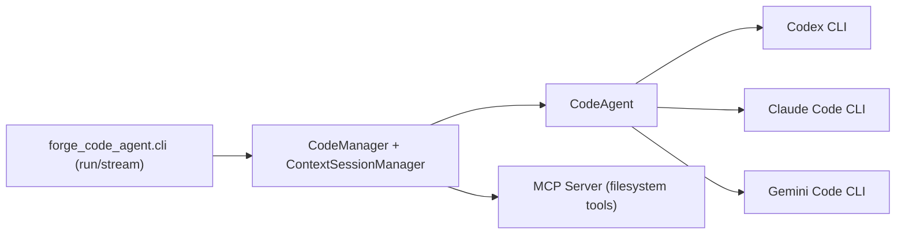

forgeCodeAgent
==============

Repositório GitHub: https://github.com/symlabs-ai/forge_code_agent
Pacote Python: `forge_code_agent`
CLI: `python -m forge_code_agent.cli`

Runtime Python e CLI oficial para orquestrar CLIs de **coding agents** (Codex, Claude Code, Gemini Code) de forma unificada, com:

- execução `run`/`stream` via `python -m forge_code_agent.cli`
- troca de provider por configuração (sem refatorar automações)
- suporte a sessão e contexto via `CodeManager` + `ContextSessionManager`
- servidor MCP local para acesso seguro ao workspace
- demos E2E em `/examples` guiadas pelo ForgeProcess (MDD → BDD → TDD).

Para a visão de produto e ValueTracks, veja também `docs/product/`.



Instalação e ambiente
---------------------

Requisitos:

- Python 3.12+
- CLIs de coding agents instaladas e autenticadas (por exemplo `codex`, `claude`, `gemini`)
- Git configurado (o processo é CLI-first, com testes e pre-commit)

No repositório:

```bash
./setup_env.sh        # cria .venv, instala deps e pre-commit
source .venv/bin/activate
pytest -q             # opcional: roda a suíte de testes
```

Execução básica via CLI
-----------------------

Execução simples com provider Codex, em um diretório de trabalho:

```bash
python -m forge_code_agent.cli run \
  --provider codex \
  --workdir project/demo_workdir \
  --prompt "Qual é a capital do Brasil?"
```

Streaming com reasoning + output:

```bash
python -m forge_code_agent.cli stream \
  --provider codex \
  --workdir project/demo_workdir \
  --prompt "Explique o que este demo faz" \
  --reasoning-with-output
```

Sessões e CodeManager
---------------------

Para manter contexto entre chamadas e alternar providers na mesma sessão, use `--session-id` (isso ativa `CodeManager` implicitamente):

```bash
python -m forge_code_agent.cli run \
  --provider codex \
  --workdir project/demo_session_sprint6 \
  --prompt "Analise este PR" \
  --session-id pr-assist-session
```

Snapshots de sessão são gravados em `logs/codeagent/session_<id>_*.json`, com:

- eventos normalizados (Codex/Claude/Gemini)
- metadados de provider, workdir e timestamps

Servidor MCP local
------------------

O forgeCodeAgent expõe um servidor MCP stdio para ferramentas de filesystem (por exemplo `read_file`, `list_dir`), que podem ser conectadas a Codex/Claude/Gemini:

```bash
python -m forge_code_agent.mcp_server --workdir project/demo_workdir
```

O framing MCP/JSON é tratado por `src/forge_code_agent/mcp_server/protocol.py`.
As tools e políticas de segurança (workspace boundaries, modo read-only) vivem em `src/forge_code_agent/mcp_server/__init__.py`.

Exemplos
--------

Alguns scripts úteis em `examples/`:

- `examples/run_codex.sh`, `run_claude.sh`, `run_gemini.sh` – rodam todos os demos por provider
- `examples/valuetrack_code_agent_execution.sh` – ValueTrack de execução via CLI
- `examples/valuetrack_tools_and_files.sh` – geração de arquivos e tools
- `examples/sprint5_pr_assist_demo.sh` – fluxo de PR assistido (Codex + Claude)
- `examples/sprint5_module_and_tests_demo.sh` – módulo + testes com refinamento multi-provider
- `examples/sprint6_demo.sh` – MCP ping, sessões e UX de CLI (Sprint 6)
- `examples/mcp/*.sh` – integrações MCP específicas (Codex/Claude/Gemini)

Arquitetura
-----------

Pacotes principais em `src/forge_code_agent/`:

- `runtime/agent.py` – `CodeAgent`, orquestra execução via CLI de cada provider
- `cli.py` – entrada principal da CLI (`run` / `stream`, flags de sessão e streaming)
- `context/session_manager.py` – `ContextSessionManager`, persistência de contexto/sessões
- `context/manager.py` – `CodeManager`, coordena CodeAgent + sessões + summarizer
- `mcp_server/__init__.py` e `protocol.py` – servidor MCP modularizado
- `domain/` – modelos de domínio (`ExecutionRequest`, `ExecutionResult`, erros, eventos)
- `adapters/cli/` – adapters específicos de Codex, Claude e Gemini

Para visão de alto nível e decisões arquiteturais:

- `specs/roadmap/HLD.md`
- `specs/roadmap/TECH_STACK.md`
- `specs/roadmap/ARCHITECTURAL_DECISIONS_APPROVED.md`

Processo (ForgeProcess)
-----------------------

Este repositório segue o ForgeProcess em camadas:

- MDD → BDD → TDD → Execution → Delivery → Feedback
- Estado atual em `process/process_execution_state.md`
- Descrição geral em:
  - `process/PROCESS.md`
  - `process/mdd/MDD_process.md`
  - `process/bdd/BDD_PROCESS.md`
  - `process/execution/roadmap_planning/ROADMAP_PLANNING_PROCESS.md`

Cada sprint/ciclo registra planejamento, progresso e aprovação em `project/sprints/`.

Testes
------

Suite de testes:

- unitários e de integração em `tests/`
- BDD em `specs/bdd/` + `tests/bdd/`

Para rodar:

```bash
pytest -q
```

Licença
-------

Este repositório é usado como projeto de referência para o ForgeProcess e para integrações de CLIs de coding agents. Consulte o proprietário do repositório sobre termos de uso e redistribuição.
