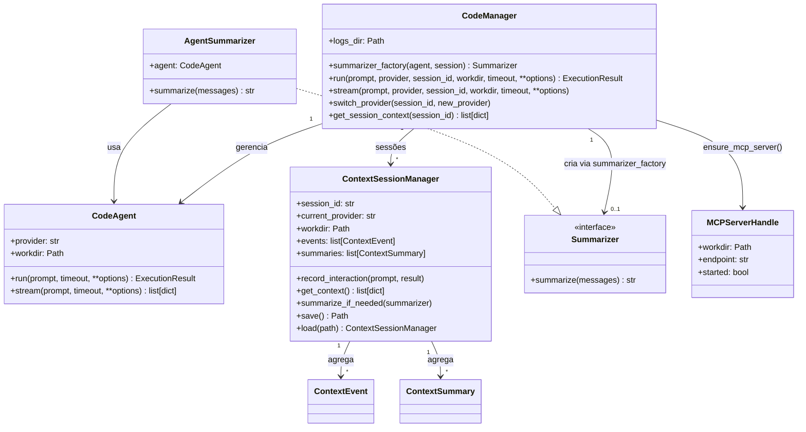

# Plano de Implementação — CodeManager + ContextSessionManager

## 1. Visão e Objetivo

**Objetivo**: introduzir um **CodeManager** que orquestra:

- múltiplos `CodeAgent`s (um por provider / config),
- um `ContextSessionManager` responsável por contexto e resumo,
- persistência de sessões em `logs/codeagent/sessionTIMESTAMP.json`.

Queremos:

- uma API de alto nível para automações:
  - `CodeManager.run(prompt, provider="codex", session_id="...")`
  - `CodeManager.stream(...)`
- possibilidade de trocar o provider (`codex` → `claude` → `gemini`) mantendo:
  - contexto conversacional/histórico,
  - metadados importantes (runs, tools, erros),
  - artefatos de sessão persistidos em disco.


## 2. Componentes Principais

### 2.1 ContextSessionManager (focado em contexto)

Responsabilidades:

- Armazenar o histórico de interações de uma sessão:
  - prompts do usuário;
  - respostas/outputs do provider;
  - eventos canônicos (`ExecutionResult.raw_events`: reasoning, message, tool, log);
  - metadados (provider, timestamps, run_id, etc.).
- Gerenciar *rolling summary*:
  - resumir partes antigas do contexto quando exceder um limite (eventos/tokens);
  - preservar:
    - decisões tomadas;
    - valores/configurações importantes;
    - TODOs, avisos e problemas recorrentes.
- Persistir e recuperar sessões de arquivos JSON em:
  - `logs/codeagent/sessionYYYYMMDD_HHMMSS.json`.

API implementada:

- `__init__(session_id: str, logs_dir: Path, max_events: int = 200, max_summary_chars: int = 128_000)`
- `record_interaction(prompt: str, result: ExecutionResult) -> None`
- `get_context() -> list[dict[str, Any]]`
  - mensagens em formato neutro (`role`, `text`, `provider`, `meta`).
- `summarize_if_needed(summarizer: Summarizer | None = None) -> None`
- `save() -> Path`
- `@classmethod load(path: Path) -> ContextSessionManager`

Formato aproximado do JSON:

```json
{
  "session_id": "2025-12-07T14-37-00Z",
  "current_provider": "codex",
  "workdir": "/mnt/c/.../project/demo_workdir",
  "created_at": "2025-12-07T14:37:00Z",
  "events": [
    {
      "role": "user",
      "text": "Qual é a capital do Brasil?",
      "provider": "codex",
      "timestamp": "2025-12-07T14:37:01Z",
      "meta": { "run_id": "..." }
    },
    {
      "role": "assistant",
      "text": "A capital do Brasil é Brasília.",
      "provider": "codex",
      "timestamp": "2025-12-07T14:37:02Z",
      "meta": { "status": "success" }
    }
  ],
  "summaries": [
    {
      "at_index": 20,
      "text": "Resumo das primeiras 20 interações...",
      "provider": "claude",
      "timestamp": "2025-12-08T10:00:00Z"
    }
  ]
}
```


### 2.2 Summarizer (injeção de estratégia)

Interface implementada:

```python
class Summarizer(Protocol):
    def summarize(self, messages: list[dict[str, Any]]) -> str: ...
```

Implementação padrão:

- `AgentSummarizer`, que usa o `CodeAgent` atual para gerar o resumo:
  - monta um prompt interno descrevendo o que deve ser preservado;
  - chama `agent.run(resumo_prompt)` e usa o `content` como resumo.

Futuro:

- permitir summarizers alternativos (ex.: modelos locais, heurísticas simples, off-line).


### 2.3 CodeManager (orquestrador)

Responsabilidades:

- Gerenciar instâncias de `CodeAgent` por provider e workdir.
- Orquestrar sessões:
  - criar/carregar `ContextSessionManager` para `session_id`;
  - acoplar `CodeAgent` adequado a cada sessão;
  - registrar todas as interações (`record_interaction` + `save`).
- Expor uma API de automação simples e provider-agnostic:

API implementada:

```python
class CodeManager:
    def __init__(
        self,
        logs_dir: Path = Path(\"logs/codeagent\"),
        summarizer_factory: Callable[[CodeAgent, ContextSessionManager], Summarizer] | None = None,
    ) -> None: ...

    def run(
        self,
        prompt: str,
        *,
        provider: str | None = None,
        session_id: str | None = None,
        workdir: Path | str | None = None,
        timeout: float | None = None,
        **options: Any,
    ) -> ExecutionResult: ...

    def stream(
        self,
        prompt: str,
        *,
        provider: str | None = None,
        session_id: str | None = None,
        workdir: Path | str | None = None,
        timeout: float | None = None,
        **options: Any,
    ): ...

    def switch_provider(self, session_id: str, new_provider: str) -> None: ...

    def get_session_context(self, session_id: str) -> list[dict[str, Any]]: ...
```

Comportamento:

- `run()`:
  - resolve `session_id` (gera um novo se não vier um);
  - resolve `workdir` (pode vir da call, de default global ou da sessão);
  - resolve `provider` (parâmetro, sessão, env, default "codex");
  - cria/obtém `CodeAgent(provider, workdir)`;
  - cria/obtém `ContextSessionManager(session_id)` (em `logs/codeagent`);
  - chama `agent.run(...)`;
  - passa `(prompt, result)` para `ContextSessionManager.record_interaction(...)`;
  - chama `summarize_if_needed()` e `save()`;
  - retorna o `ExecutionResult` bruto.

- `switch_provider(session_id, new_provider)`:
  - atualiza o provider preferido da sessão;
  - não altera o histórico; apenas as próximas chamadas de `run/stream`
    passarão a usar o novo provider.

### 2.4 Diagrama de Classes (alto nível)




## 3. Persistência e Layout em Disco

- Diretório base: `logs/codeagent/`
- Nome dos arquivos de sessão:
  - `session_<SESSION_ID>_<YYYYMMDD_HHMMSS>.json`
  - Também podemos manter um symlink/arquivo `session_<SESSION_ID>_latest.json`
    apontando para o último snapshot.

Convenções:

- `CodeManager` garante que `logs/codeagent/` existe (`mkdir(parents=True, exist_ok=True)`).
- As sessões devem ser pequenas o suficiente para serem lidas com segurança;
  se necessário, podemos comprimir/resumir mais agressivamente no futuro.


## 4. Integração Inicial com forgeCodeAgent

Fase 1 (MVP interno):

- Implementar `ContextSessionManager` e `CodeManager` apenas como API Python:
  - sem expor flags novas na CLI ainda;
  - com testes unitários cobrindo:
    - criação de sessão;
    - `run()` com dois providers diferentes usando o mesmo `session_id`;
    - persistência e re-load de contexto (`save()` + `load()`).

Fase 2 (CLI-first):

- Estender `forge_code_agent.cli` com flags opcionais:
  - `--session-id` (string);
  - `--manager` ou um subcomando `session-run`:
    - internamente, usa `CodeManager` em vez de instanciar `CodeAgent` direto.
- Documentar no README/planos como usar sessões via CLI.


## 5. Roadmap Técnico (Passos de Implementação)

1. **ContextSessionManager**
   - Criar módulo `src/forge_code_agent/context/session_manager.py`. ✅
   - Definir modelos simples de evento (`ContextEvent`) e resumo. ✅
   - Implementar:
     - armazenamento em memória (`events`, `summaries`); ✅
     - `record_interaction(prompt, ExecutionResult)` mapeando `ExecutionResult.raw_events` para eventos de contexto; ✅
     - `save()` / `load()` para `logs/codeagent/*.json`. ✅
   - Adicionar testes unitários específicos (`tests/test_context_session_manager.py`). ✅

2. **Summarizer padrão**
   - Definir o protocolo `Summarizer`.
   - Implementar `AgentSummarizer` que usa um `CodeAgent` para resumir uma lista de mensagens.
   - Integrar com `ContextSessionManager.summarize_if_needed()`.

3. **CodeManager (núcleo)**
   - Criar módulo `src/forge_code_agent/context/manager.py`. ✅
   - Implementar:
     - cache de `CodeAgent`s por `(provider, workdir)`; ✅
     - cache de `ContextSessionManager` por `session_id`; ✅
     - método `run(...)` conforme API proposta; ✅
     - método `switch_provider(...)` e `get_session_context(...)`. ✅
   - Adicionar testes unitários (`tests/test_code_manager.py`) para:
     - múltiplas chamadas `run()` na mesma sessão; ✅
     - troca de provider mantendo contexto; ✅
     - persistência correta em `logs/codeagent`. ✅

4. **Integração CLI (opcional nesta fase)**
   - Avaliar se já incluímos flags de sessão no CLI atual ou deixamos para uma sprint futura.
   - Se incluirmos:
     - criar subcomando `session-run` que delega para `CodeManager`.


## 6. Considerações de Evolução

- No futuro, o `ContextSessionManager` poderá:
  - integrar-se ao MCP (por exemplo, como recurso `logs://session/<id>`);
  - exportar contextos/execuções para análise externa (dashboards, BI).
- O `CodeManager` poderá:
  - aplicar políticas (quotas, limites de custo, limites por provider);
  - coordenar múltiplas sessões em paralelo (por exemplo, em CI/CD).

Este plano é o guia para a implementação incremental de um gerenciador de contexto
reutilizável, mantendo o espírito CLI-first e BDD/TDD do forgeCodeAgent.

---

## 7. Evolução: MCP sob responsabilidade do CodeManager

Hoje o MCP server foi introduzido como componente à parte, com um helper simples no runtime. A direção desejada é:

- **CodeManager como orquestrador de MCP**:
  - o CodeManager passa a ser responsável por:
    - garantir que exista um MCP server adequado para cada `workdir` / sessão;
    - decidir quantos servidores MCP sobem (ex.: por projeto, por sessão, compartilhado);
    - centralizar a configuração dos MCP servers (tools habilitadas, políticas de segurança).
  - o MCP deixa de ser uma responsabilidade direta do `CodeAgent`/runtime.

- **CodeAgent/adapters como consumidores de MCP**:
  - cada adapter de provider (`CodexProviderAdapter`, `ClaudeProviderAdapter`, `GeminiProviderAdapter`) passa a:
    - receber do CodeManager (via options/env) as informações de MCP:
      - endpoint, env vars relevantes, flags de CLI;
    - aplicar as idiossincrasias específicas de cada provider para falar com MCP
      (por exemplo, comandos `codex mcp ...`, flags próprias, etc.).
  - o CodeManager não sabe “como” cada provider usa MCP; ele apenas garante que
    o servidor exista e fornece a config necessária.

Impactos planejados (em etapas futuras):

1. Introduzir, no `CodeManager`, uma camada de gestão de MCP:
   - cache de `MCPServerHandle` por `workdir`/sessão;
   - API interna do tipo `get_mcp_config_for_session(session_id) -> dict`.
2. Refatorar o runtime/`CodeAgent` para remover o acoplamento direto com MCP:
   - `ensure_mcp_server()` passa a ser chamado (quando necessário) pelo CodeManager,
     não pelo `CodeAgent` em `run()`.
3. Adaptar os providers:
   - cada adapter lê a configuração MCP da chamada (env/options) e a transporta
     para a CLI do provider conforme suas regras.

Essa evolução mantém a arquitetura limpa:

- CodeManager: **ambiente + contexto + MCP** (orquestração).
- ContextSessionManager: **histórico + resumo + persistência de sessão**.
- CodeAgent/adapters: **execução concreta por provider**, inclusive integração MCP específica.

---

## 8. Extensão MCP para Claude e Gemini

Além do Codex, o objetivo é que Claude e Gemini também aproveitem o MCP de forma consistente:

- **Claude**:
  - O CodeManager expõe a mesma configuração MCP (endpoint/env) para sessões que usam Claude.
  - O adapter Claude será responsável por:
    - anunciar/consumir o servidor MCP conforme o modelo de integração que o CLI de Claude oferecer;
    - mapear ferramentas MCP (como `read_file`, `write_file`, `list_dir`) para o formato esperado pelo cliente Claude.

- **Gemini**:
  - Estrutura análoga: CodeManager fornece configurações MCP, adapter Gemini traduz para o dialeto da CLI Gemini.

Próximas etapas (em sprints futuras):

1. Implementar integração MCP para Claude e Gemini seguindo o mesmo padrão já validado com Codex.
2. Adicionar demos equivalentes em `examples/mcp/`:
   - `claude_tools_demo.sh`
   - `gemini_tools_demo.sh`
3. Criar cenários BDD `@mcp @e2e` específicos para Claude e Gemini, referenciados no ValueTrack MCP.

O CodeManager será o ponto único de configuração para esses três providers (Codex, Claude, Gemini), garantindo uma experiência homogênea de tools/contexto entre todos.
