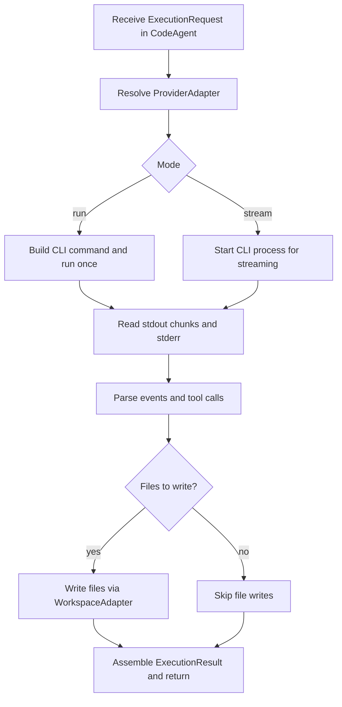

# HLD — High Level Design — forgeCodeAgent

> Versão: 0.1 (draft)  
> Responsável: mark_arc

---

## 1. Visão Geral

O forgeCodeAgent é composto por três áreas principais:

- **Domínio (sobre forgebase.domain)** — modelos e regras de negócio (providers, requests, results, tool calls, errors) baseados em `EntityBase`/exceptions do ForgeBase.
- **Adapters (forgebase.adapters/infrastructure)** — integração com CLIs, filesystem, logging/métricas (ports & adapters seguindo o padrão ForgeBase).
- **Runtime/CLI** — `CodeAgent` como fachada pública e CLI `forge-code-agent`.

---

## 2. Componentes Principais

- `CodeAgent` (runtime):
  - expõe `run()` e `stream()`;
  - resolve providers via registry;
  - orquestra execução, tool calling e persistência de arquivos.
- `ProviderAdapter`:
  - constrói comandos de CLI;
  - processa stdout/stderr em eventos;
  - sinaliza suporte a streaming/tool calling.
- `ToolCallingEngine`:
  - gerencia registro de tools;
  - executa funções Python sob demanda;
  - registra resultados/erros em `ExecutionResult`.
- `FilesystemWorkspaceAdapter`:
  - garante sandbox de workspace;
  - escreve/atualiza arquivos de código e metadados.

---

## 2.1 Diagrama de Componentes (Mermaid)

```mermaid
flowchart LR
  subgraph Domain
    ER[ExecutionRequest]
    RES[ExecutionResult]
    TCE[ToolCallingEngine]
    FB[forgebase.domain\n(EntityBase, exceptions)]
  end

  subgraph Adapters
    PA["ProviderAdapter: codex | claude | gemini"]
    WS[FilesystemWorkspaceAdapter]
    LOG[LoggerPort]
    MET[MetricsPort]
  end

  CLI[forge-code-agent CLI]
  CA[CodeAgent]
  PROVIDER_CLI[(Provider CLIs)]
  FS[(Filesystem)]

  CLI --> CA
  CA --> ER
  CA --> PA
  CA --> TCE
  CA --> WS
  CA --> LOG
  CA --> MET

  ER --> FB
  RES --> FB
  PA -->|"subprocess"| PROVIDER_CLI
  WS --> FS
```

---

## 3. Fluxo de Execução (Alto Nível)

1. `CodeAgent` recebe um `ExecutionRequest`.
2. Resolve o `ProviderAdapter` adequado.
3. Para `run()`:
   - constrói o comando, invoca `subprocess.run()`, captura stdout/stderr;
   - parseia eventos, incluindo tool calling;
   - preenche um `ExecutionResult`.
4. Para `stream()`:
   - inicia `subprocess.Popen()`;
   - emite eventos incrementais, incluindo tool calls e erros;
   - finaliza com `ExecutionResult` agregado ou status final.
5. Se houver arquivos a escrever:
   - delega para `FilesystemWorkspaceAdapter` com validação de paths.

### 3.1 Fluxograma do Fluxo de Execução



---

## 4. Integração com ForgeBase

- Via ports (`LoggerPort`, `MetricsPort`) injetáveis em `CodeAgent` ou no runtime.
- Sem dependência direta do pacote ForgeBase no core.
