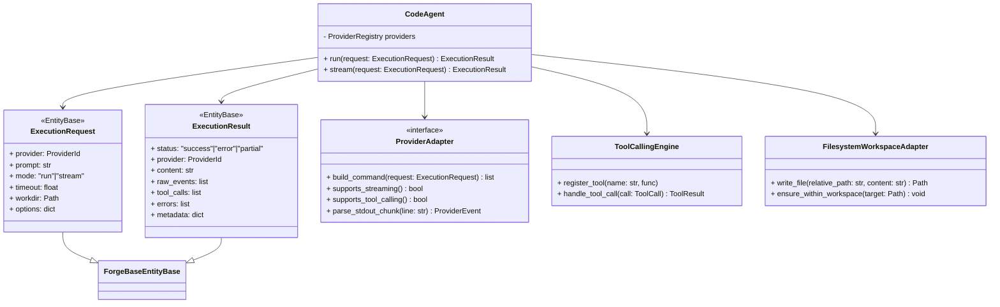

# LLD — Low Level Design — forgeCodeAgent

> Versão: 0.1 (draft)  
> Responsável: mark_arc

---

## 1. Assinaturas de Tipos Principais (esboço)

```python
@dataclass
class ExecutionRequest:
    provider: ProviderId
    prompt: str
    mode: Literal["run", "stream"]
    timeout: float | None
    workdir: Path
    options: dict[str, Any]


@dataclass
class ExecutionResult:
    status: Literal["success", "error", "partial"]
    provider: ProviderId
    content: str | None
    raw_events: list[dict]
    tool_calls: list[ToolCall]
    errors: list[ExecutionError]
    metadata: dict[str, Any]
```

---

## 2. Interface de ProviderAdapter (esboço)

```python
class ProviderAdapter(Protocol):
    id: ProviderId

    def build_command(self, request: ExecutionRequest) -> list[str]: ...

    def supports_streaming(self) -> bool: ...

    def supports_tool_calling(self) -> bool: ...

    def parse_stdout_chunk(self, line: str) -> ProviderEvent: ...
```

---

## 3. Integração com subprocess (esboço)

```python
class CliExecutor:
    def run(self, cmd: list[str], timeout: float | None) -> CompletedProcess: ...

    def stream(self, cmd: list[str], timeout: float | None) -> Iterable[str]: ...
```

---

## 4. Workspace Adapter (esboço)

```python
class FilesystemWorkspaceAdapter:
    def __init__(self, workdir: Path) -> None: ...

    def write_file(self, relative_path: str, content: str) -> Path: ...

    def ensure_within_workspace(self, target: Path) -> None: ...
```

---

## 5. Pontos em Aberto

- Detalhar `ProviderEvent` e o protocolo de eventos para streaming.
- Detalhar o formato exato de `ToolCall` e `ToolResult`.
- Decidir o equilíbrio entre exceptions e statuses em `ExecutionResult` conforme implementarmos TDD.

---

## 6. Diagrama de Classes (Mermaid — esboço)


