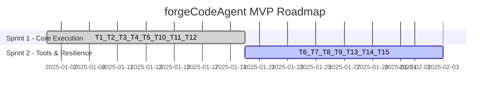

# TDD Roadmap — forgeCodeAgent

> **Status**: Approved (Execution – Phase 5 concluída)
> **Versão**: 0.1
> **Data**: 2025-12-05
> **Aprovador**: Tech Lead / Stakeholder (via Execution)

---

## 🎯 Objetivo

Implementar o runtime `forgeCodeAgent` capaz de:
- executar prompts de código via múltiplos providers de CLI (`run`/`stream`);
- trocar de provider sem refatorar automações;
- executar tool calling com funções Python;
- persistir arquivos no workspace com segurança;
- expor erros de provider/CLI/JSON/timeouts de forma clara e observável.

Tudo isso guiado pelas features BDD e pelo feature breakdown T1–T15.

---

## 📊 Timeline Executiva

### Sprint 1 (Semanas 1–2): Núcleo de Execução via CLI

**Track**: `value_forge_core_code_agent_execution` + partes de `support_observability_code_agent_resilience`
**Objetivo**: ter `CodeAgent.run()` e `CodeAgent.stream()` funcionando com um provider de referência (Codex-like), com contrato de resultado e erros básicos.

**Tasks (T1–T5, T10–T12)**:
- T1 — Domain models and basic contracts.
- T2 — ProviderAdapter protocol and registry.
- T3 — Synchronous `run()` via subprocess.
- T4 — Streaming execution.
- T5 — Provider swap without refactor.
- T10 — Error model.
- T11 — Handling of unsupported providers.
- T12 — CLI failure handling (`ProviderExecutionError` + stderr).

**Features BDD cobertas**:
- `10_code_agent_execution.feature`
- parte de `50_code_agent_resilience.feature` (provider inválido, falha de CLI).

**Milestone 1**:
`CodeAgent` executa prompts via CLI com status explícito e troca de provider configurável, e falhas de provider/CLI são sinalizadas corretamente.

**Riscos**:
- Interações sutis entre parsing de saída e erros de CLI.
  → Mitigação: priorizar cenários de resiliência BDD desde o início.

---

### Sprint 2 (Semanas 3–4): Tool Calling, Arquivos e Resiliência Completa

**Track**: `value_forge_core_tools_and_files` + restante de `support_observability_code_agent_resilience`
**Objetivo**: habilitar tool calling, escrita segura de arquivos em workspace e cobrir os casos de resiliência restantes.

**Tasks (T6–T9, T13–T15)**:
- T6 — ToolCallingEngine.
- T7 — Integração de tool calling em `run`/`stream`.
- T8 — FilesystemWorkspaceAdapter.
- T9 — Sandbox de workspace (path traversal).
- T13 — Interrupção de streaming com resultados parciais.
- T14 — JSON malformado.
- T15 — Timeouts + captura segura de stderr.

**Features BDD cobertas**:
- `11_code_agent_tools_and_files.feature`
- restante de `50_code_agent_resilience.feature` (interrupção, JSON malformado, timeout, stderr).

**Milestone 2**:
Tool calling funcional, arquivos gerados/atualizados no workspace com sandbox, e todas as situações de erro previstas na feature de resiliência cobertas.

**Riscos**:
- Complexidade na interface entre parsing, tool calling e workspace.
  → Mitigação: manter responsabilidades separadas entre domínio, adapters de CLI e workspace.

---

## 📈 Gantt Visual (alto nível)

> As datas são ilustrativas e devem ser ajustadas conforme a cadência real do time.

---

## 🎯 Milestones e Critérios de Conclusão

### Milestone 1: Core Execution

**Critérios**:
- [ ] `CodeAgent.run()` funcionando com provider de referência (Codex-like).
- [ ] `CodeAgent.stream()` entregando eventos incrementais com indicação clara de término.
- [ ] Troca de provider via configuração sem refatorar scripts de automação.
- [ ] Erros de provider não suportado e falha de CLI cobrem os cenários BDD.

---

### Milestone 2: Tools, Files & Resilience

**Critérios**:
- [ ] Tool calling executa funções Python registradas e reflete resultados nas respostas.
- [ ] Arquivos gerados são escritos apenas dentro do workspace, com proteção contra path traversal.
- [ ] Interrupções de streaming, JSON malformado e timeouts produzem erros claros e rastreáveis.
- [ ] stderr relevante é capturado para diagnóstico (sem vazamento excessivo).

---

## ⚠️ Riscos e Mitigações

| ID | Risco | Probabilidade | Impacto | Mitigação | Owner |
|----|-------|---------------|---------|-----------|-------|
| R1 | Parsing de saída variável entre providers | MÉDIA | ALTO | Começar com Codex-like, definir ProviderAdapter bem isolado e adicionar providers gradualmente | Tech Lead |
| R2 | Path traversal ou escrita indevida de arquivos | BAIXA | ALTO | Implementar sandbox rígido no WorkspaceAdapter e cobrir cenários de segurança em BDD | Tech Lead |
| R3 | Tool calling com efeitos colaterais inesperados | MÉDIA | MÉDIO | Definir API enxuta de tools e começar com tools puras de escrita de arquivo | Tech Lead |

---

## 📦 Dependências Externas

- [ ] Disponibilidade das CLIs de providers (Codex-like, Claude, Gemini) no ambiente de desenvolvimento/CI.
- [ ] Decisão de qual provider será usado nos pilotos iniciais.

---

## 🔄 Processo de Atualização

Este roadmap deve ser revisado:
- ao final de cada sprint (review/retro);
- sempre que decisões de arquitetura (ADRs) forem atualizadas;
- quando novos ValueTracks/Features forem adicionados ao forgeCodeAgent.

**Última atualização**: 2025-12-05 por mark_arc
