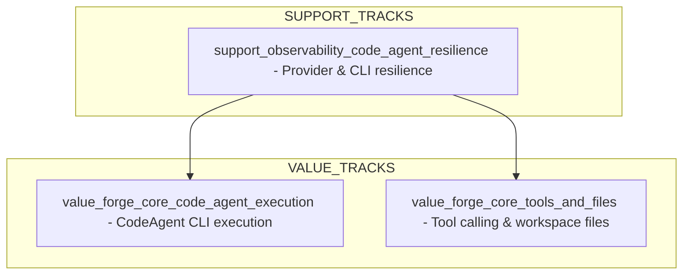

# dependency_graph — forgeCodeAgent

> Versão: 0.1 (draft)
> Responsável: roadmap_coach + mark_arc
> Fonte: `specs/bdd/tracks.yml`, features BDD

---

## 1. Narrativa

Este grafo descreve dependências de alto nível entre os ValueTracks e SupportTracks do forgeCodeAgent para o escopo de MVP:

- `value_forge_core_code_agent_execution` — execução básica via CLI e troca de provider.
- `value_forge_core_tools_and_files` — tool calling e persistência de arquivos.
- `support_observability_code_agent_resilience` — erros de provider/CLI/JSON, interrupções, timeouts e stderr.

---

## 2. Grafo de Dependências (Mermaid)

Leitura:

- O track de resiliência (`S1`) suporta e é pré-requisito de qualidade para:
  - execução básica via CLI (`V1`);
  - tool calling e persistência de arquivos (`V2`).

---

## 3. Observações

- Para o MVP, não há dependência estrita de ordem entre `V1` e `V2` — ambos podem evoluir em paralelo, desde que o suporte de resiliência (`S1`) acompanhe.
- Detalhamento de dependências em nível de tarefa será feito em `specs/roadmap/feature_breakdown.md`, derivado deste grafo e das features BDD.
